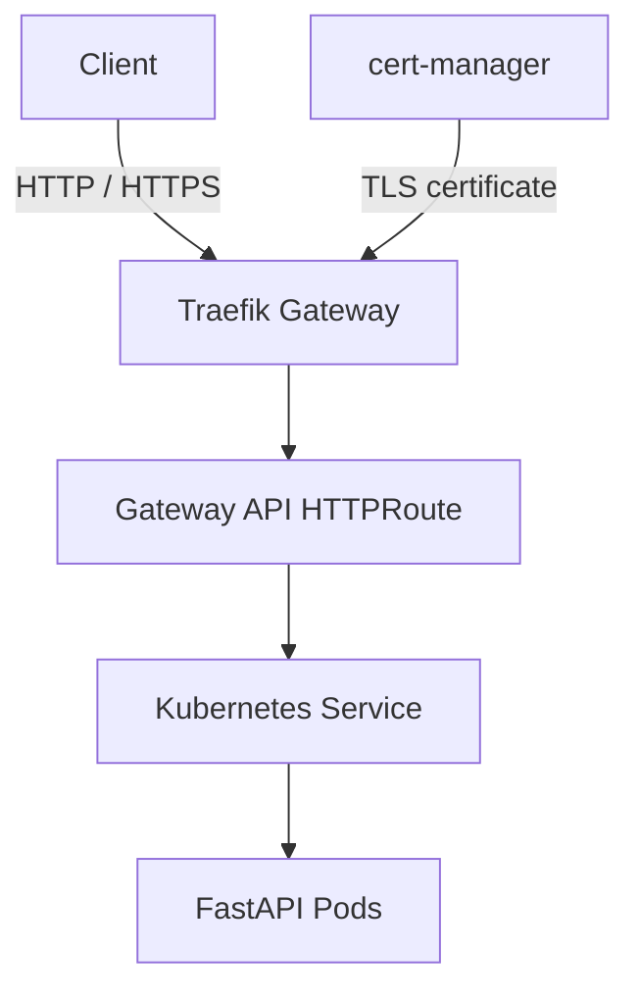

# SRE Platform Lab

A hands-on platform engineering lab for building, deploying, securing, and operating a containerized service on Kubernetes.

The project focuses on practical delivery workflows, GitOps, observability, and reliability engineering.

## Architecture

## Implemented

- Containerized FastAPI service
- Kubernetes Deployment with two replicas
- Readiness and liveness probes
- CPU and memory requests and limits
- Non-root container security context
- Rolling updates and rollback practice
- Traefik Gateway API routing
- TLS certificates managed by cert-manager
- Local certificate authority for development
- HTTP-to-HTTPS redirect
- Reproducible local cluster with kind

## Repository Layout

| Path | Purpose |
| --- | --- |
| `app/` | Application source and container image definition |
| `k8s/` | Kubernetes workload, service, and routing manifests |
| `infra/kind/` | Local Kubernetes cluster configuration |
| `infra/traefik/` | Traefik Gateway configuration |
| `infra/cert-manager/` | Certificate management configuration |

## Current Environment

| Component | Version |
| --- | --- |
| Kubernetes | 1.36.4 |
| kind | 0.33.0 |
| Helm | 4.2.4 |
| Traefik | 3.7.12 |
| cert-manager | 1.21.1 |

## Roadmap

- GitHub Actions test and container build pipeline
- Container image publishing to GitHub Container Registry
- Reusable Helm application chart
- Argo CD continuous delivery
- Prometheus metrics and Grafana dashboards
- Actionable alert rules and failure exercises
- AKS reliability and operational reviews

## Scope

This repository is a local engineering lab. It currently uses a private development certificate authority and is not intended to be used as-is in production.
